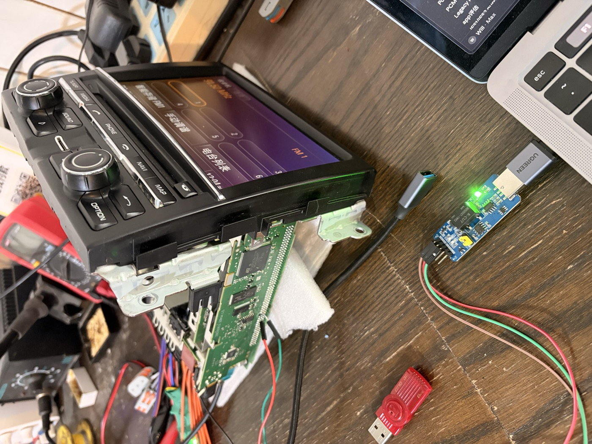
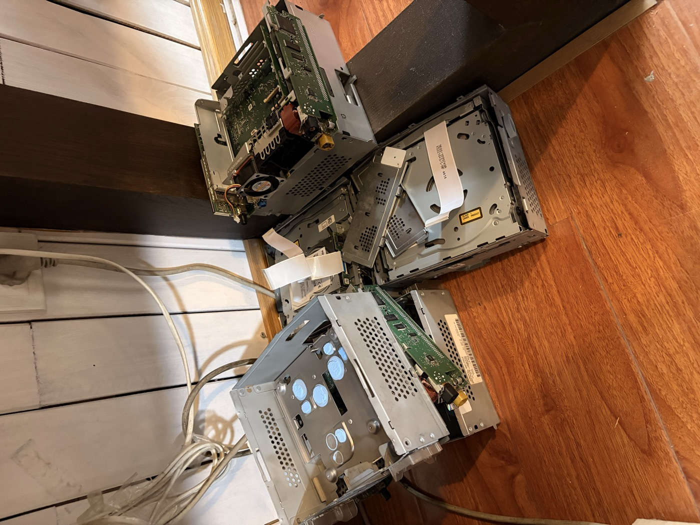
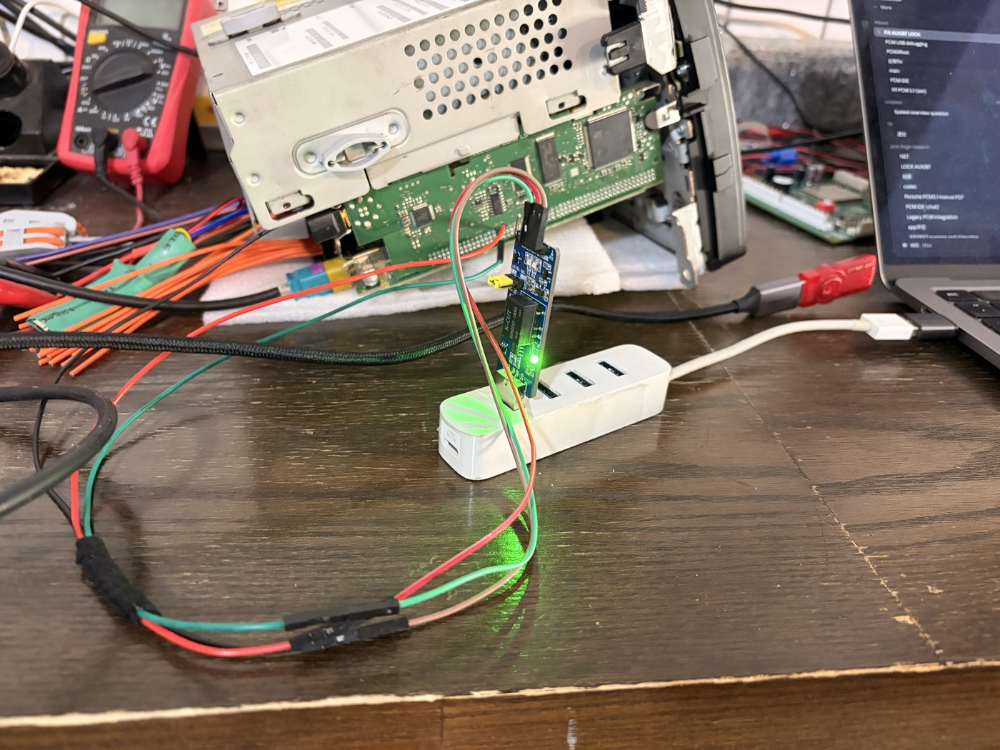
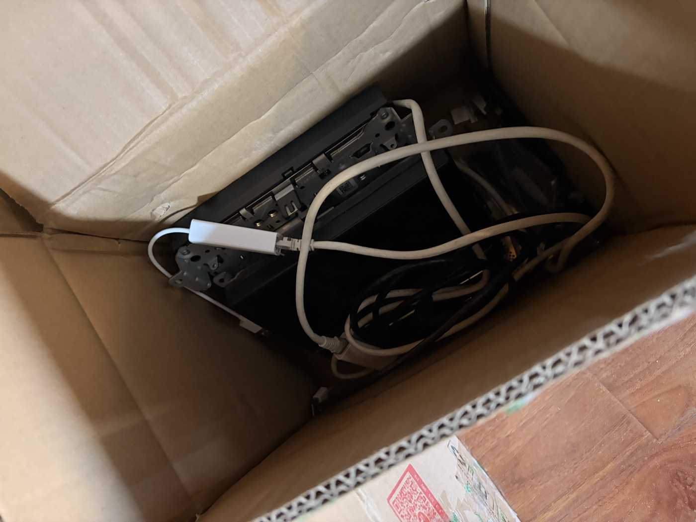
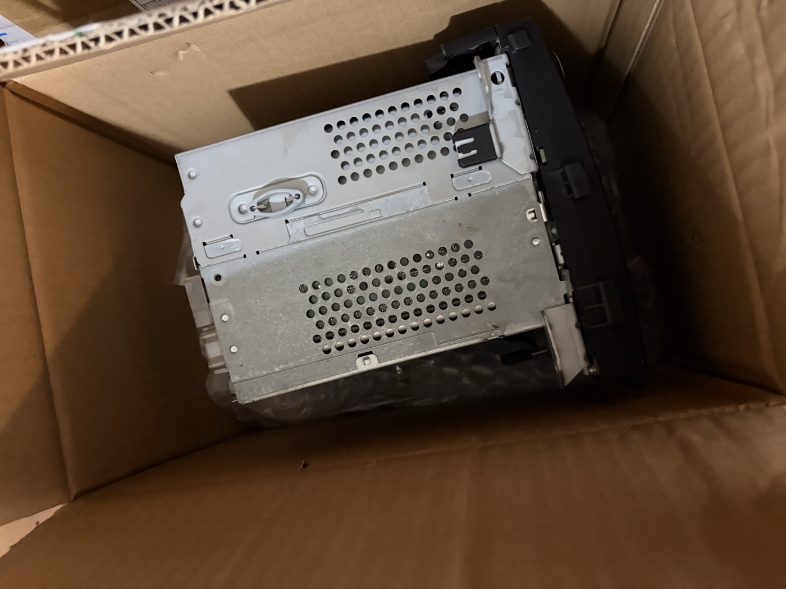

# PCM_31_AUX-BT —— Porsche PCM3.1 蓝牙音频修复全过程

> Porsche PCM3.1 车机(CHN/MOPF 变体,台架件)。QNX 6.3.x + SH-4A(SuperH,小端)。
> 这份文档记录的是**我踩过的一整条真实痛点链**,不止一个 bug。整条链从一个日常最烦人的现象开始,一路挖到 SH4 反汇编 + 内存注入,最后合成一个干净固件。背后还搭上了两台报废台架的学费。

| 部分 | 讲什么 |
|---|---|
| [第一部分 · 技术解释](#第一部分--技术解释) | 原厂系统怎么工作、硬件事实、根因(只写结论) |
| [第二部分 · 技术方案](#第二部分--技术方案) | 做了什么、为什么管用、怎么交付、怎么验证 |
| [第三部分 · 涉及的问题](#第三部分--涉及的问题) | 现象、每条死路及其失败的确切原因、坑与教训 |
| [附录](#八关键坐标台架-mopf-二进制vaddr) | 关键坐标 · 关键文件 · 致谢 |


*活着的工作台架:PCM3.1 开机跑着 FM,右下 K-CUT USB-串口适配器(绿灯亮),红黑绿跳线是 57600 串口,MacBook 上是本项目任务列表。*

**两章的故事:**
- **第一章**(最早、最烦的痛点):用蓝牙放着歌,熄火下车;下次上车,车机**每次都回到 FM**,得手动切回蓝牙音频。→ **锁BT(fmguard)** 修复(2026-07-06,台架 + 真车 911/9x1 双双实刷确认)。
- **第二章**(锁住蓝牙后冒出的新问题):开机保持蓝牙连上了,**却没有声音、没有歌名**,得手动切一次 AUX→BT 才出声。→ **child-vtable shotgun** 修复(2026-07-08,本文主体的深挖)。
- 最后两个修复**合成一个干净固件**(stock + 锁BT + 开机出声),USB autorun 零串口部署。

---

## 第一部分 · 技术解释

先把读懂后面所有内容需要的前提讲清楚:这台车机的音频源控制原本是怎么工作的,以及"开机没声音"的根因到底在哪。这一部分只写结论。怎么一步步逼出这些结论、中间踩了多少死路,全在第三部分。

### 系统背景

- **音频源控制架构**(三层):
  - L1 App 层:源枚举(7=A2DP 蓝牙 / 11=FM / 24=AUX …)
  - L2 SourceSinkSupervisor(子对象 = child):管理源-宿映射、连接
  - L3 每源 EntertFSM:激活状态机
- **主对象 CPSoundPresCtrl**:控制面(SH4 侧只做控制,不碰音频数据流)。
- **功放**:类型由 `/HBpersistence/audioAmp{ASK,BOSE,BURMESTER}` 空标记文件决定。台架没接物理功放,须建 `audioAmpASK`(内置)标记,源切换的异步 TLAM 握手才能完成、才有声。
- **台架 vs 真车**:台架 = Panamera(G1 硬件板);真车 = 911(9x1)。软件改不成 911(硬件自报)。本次修复针对台架 MOPF 二进制。

### 根因(锁BT):源仲裁漏斗

真正管用的落点在运行时源仲裁:开机(以及手机断开)时,FM 会被提交为源、把蓝牙顶掉。

### 根因(反编译 + 活体 + sh4emu 三方一致)

**开机把 BT 设成源,但从不"申请音频焦点"(requestRequestAudioFocus)。** 链条:

```
手动 AUX→BT
  → 源切换函数 entertSourceChanged(0x082a717c) / vtable+0x34(0x082a4854)
  → 内部调 requestRequestAudioFocus
  → 把一个请求推进"激活FSM"到 AUDIBLE(状态=5)

getter FUN_082a46b0:
  返回"请求列表里首元素状态==5(AUDIBLE)"的源,否则返回 -2

establishment FUN_082a4e8c:
  第一道门 = getter() != -2
  过了才设 TLAM、requestRequestAudioFocus(state 7)、命令 DSP → 出声
```

**bug 的产生**:开机没走源切换 → 请求列表里没有 AUDIBLE 元素 → getter 返 **-2** → establishment **短路** → 不申请焦点 → **无声**。

**一句话**:缺一次"音频焦点申请",而它只由真正的源切换产生。这解释了为什么手动 AUX→BT 管用(它就是真源切换),而 BT→BT 重选不管用(不是真改变)。

---

## 第二部分 · 技术方案

这一部分是最终落地的东西:两个补丁(锁BT 的 fmguard、开机出声的 child-vtable shotgun)、把它们造出来和验证它们的工具、合成的干净固件,以及台架与真车的实刷。这里同样只写结论;为什么绕了远路,见第三部分。

### fmguard(源仲裁守卫)

**fmguard = 一段 18 字节的 cave**,挂在仲裁的池槽 **0x082ac898**(改指向 cave)+ cave 本体在 0x083f2908~2918:**当"要提交的源"是 FM 时,就不提交**——于是 FM 无法在开机/断开时自动抢占,蓝牙得以保持。手动切源不受影响。

### 确认

- **台架实刷** + **真车 911/9x1 实刷**双双确认:断开手机 / 熄火重启**不再掉回 FM**,蓝牙保持。
- 这就是本文"干净固件"里 **`锁BT`** 那一半的来历。

> 但锁住蓝牙后,冒出了下一个更隐蔽的问题——**开机保持蓝牙连上了,却没有声音**。这就进入第二章。

---

### 解法:child-vtable shotgun

**核心思想**:不定位"哪个具体方法是连接 handler"(定位太难),而是**把 child vtable 全 5 个方法都插桩 + 带门**——谁在 bug 态被调到,谁就触发一次修复。用全插桩绕开定位难题。

**结构**:每个 vtable 槽 → 12 字节 stub(载原方法地址入 r0,bra 共享例程)→ 共享例程做:

```
共享例程(r0=原方法, r4=child):
  存 r4-r7/r0/r14/pr             ; 透明:保住原方法的参数
  r14 = 0x086ed694               ; 硬编码 main ← 这就是那个缺陷(见第三部分「最后一公里」):
                                 ; 当时以为它固定,其实每次开机都漂。最终版改为自派生。
  child = *(main+0x1f0)
  若 child < 0x08600000  → 跳过   ; null/未初始化安全
  若 *(child+0x68) != -2 → 跳过   ; 只在"BT连上但未激活"的 bug 态触发
  若 *(main+0x94c) != 1  → 跳过   ; 一次性 + 防递归门
  *(main+0x94c) = 0              ; 先置 0:entertSourceChanged 内部会重入
                                 ; child 方法,置 0 让重入的调用跳过,防无限递归
  entertSourceChanged(main, &24, &0)   ; 切 AUX
  entertSourceChanged(main, &40, &0)   ; 切回 BT
跳过:
  恢复 pr/r14/r0/r4-r7
  jmp @r0                        ; 透明尾调原方法(pr 不动,方法 rts 回真调用者)
```

**为什么灵**:开机连上时,连接事件会调到 child 的某个 vtable 方法。此刻 `child+0x68==-2`(连上未激活)且 `main+0x94c==1`(bug 态),门通过 → 强制一次 AUX→BT → establishment 激活 → 出声。`main+0x94c` 兼作一次性门(激活后变 0,不再触发)+ 防递归门。

**实测确认**:main+0x94c=0(触发一次)、child+0x68=40(BT 激活)、源字段=BT、我听到了声音。

工具:`code/bluetooth-fix/build_shotgun_child.py`(汇编器,基于 `code/bluetooth-fix/build_shotgun.py` 主版改:vtable=0x085700e0 / 5 槽 / main 硬编码)。

---

### 真正的修:从 `this` 派生 `main`

在 child-vtable 方法里,唯一永远有效的指针就是分发的 `this` —— child 对象本身。所以:别猜 `main`,**走过去**。child 回到 main 有一条结构性的反向链:

```
main = *(*(*(child + 0x38) + 0x08) + 0x70)
```

每一跳在解引用**之前**做区间检查 `[0x08600000, 0x08f00000)`,最终结果再交给原有的 `g_self` vtable 校验。所以对象图没建好/正在重连的状态会**干净地 bail、下次调用再试**,而不是 fault。零扫描、零硬编码、不怕漂、不需要第二个钩子、不需要 stash。

上界取 `0x08f00000` 而**不是** `0x09000000` 是有具体原因的:一个刚好通过 `< 0x09000000` 检查、但贴着上界的指针,会让"指针+偏移"读到**已映射窗口之外**并 fault。收紧上界堵掉了对抗审查能找到的唯一一条 fault 路径 —— 而且零代价,因为真实的中间值全都在 `0x086e_____` 附近。

这条链是**结构性的,不是撞运气**:手头每一份快照都解得对 —— 台架 playing/disconnected/AUX、真实 `-2` 连接bug快照、修好后的工作态、以及**真车** —— 六个 `main` 地址,全中。

cave 的其余部分和 2026-07-08 那个已证的 shotgun **逐字节相同**:同样挂全 5 方法、同样的 `child+0x68 == -2 && main+0x94c == 1` 门、同样的 AUX→BT 两连发、同样的 `*(main+0x94c) = 0` 一次性门。(单独的 `.bss` 门闩方案被**否决**:它一次开机只能响一次;而 `+0x94c` 是 app 每次重连都会重新 arm 的 —— 那才是这个场景需要的。)

### 刷之前先证明

`validate_shotgun_child_chain.py` 在 `sh4emu` 里拿真实的 `-2` 连接bug快照跑这个 cave:

- **T1** —— 用 `this = child` 分发:cave **自己派生**出 `main`、过门、调 `entertSourceChanged(main,24)` 再 `(main,40)`、清掉 `+0x94c`。零 fault。
- **T2** —— 用非 child 对象分发:不开火,不崩。
- **T3** —— 把 `*(child+0x38)` 改成越界指针:跳守卫 bail。零 fault。(没有守卫的话,这一次解引用就是那块砖。)

---

### 工具突破(以后都用得上)

#### 5.1 可靠 SH4 反汇编 = Debian binutils-multiarch 的 objdump
capstone 会乱码、Ghidra 反编译错位——只有 GNU objdump(2.35+,支持 SH)是 ground truth,还自动解析 pool 值和字符串地址。
```bash
# 建镜像(一次)
docker build --platform linux/386 -t sh4gdb:latest -  <<'EOF'
FROM debian:bullseye-slim
RUN apt-get update -qq && apt-get install -y -qq libncurses5 binutils-multiarch
EOF
# 备料:PCM3Root 的 LOAD1 段(vaddr 0x08040000)存成 raw text.bin
# 反汇编(--adjust-vma 让 fileoff 0→0x08040000)
objdump -D -b binary -m sh4 -EL --adjust-vma=0x08040000 \
  --start-address=0x082a4854 --stop-address=0x082a4900 text.bin
```

#### 5.2 sh4emu(SH4 解释器)
`code/common/sh4emu.py` + `code/common/sh4_run_switch.py`。在真车/台架 16MB 内存快照上**真执行 PCM3Root 任意函数**,离线动态验证(治盲静态 RE 认错、不费 flash)。每个手写 cave 都在这里验证透明性、门逻辑、防递归,再刷。

#### 5.3 IFS 构建管线
PCM3Root 在 IFS1 里逐文件 LZO 压缩。`code/`:inflate → patch-file(同尺寸替换)→ deflate(--ref 保块形状 + 外层 sum-to-zero)。**预检门** `code/common/verify_ifs_flashable.py`:startup 段 + imagefs 段各 sum32le==0——**就是"前情"里砖掉两台台架换来的那道门**,任一段非零绝不刷。本文后面几次实刷都先过它。

#### 5.4 台架内存读写
- 读:串口 `hd -s <addr> -n <len> /proc/12316/as`(PID 恒 12316)。
- 写(仅 RW):`mp2` = `code/common/sh4tools/mempoke.c`,1 字节/次。

---

### 干净最终固件 + USB autorun

#### 组成
我想要个只留有效修改的干净版。diff 已证实的 fmguard.ifs 确认:锁BT 只需 4 处补丁。于是干净固件 =

```
stock PCM3Root
  + fmguard(锁BT,断开不掉FM):0x082ac898 池槽 → cave 0x083f2908~2918
  + child-shotgun(开机出声):child vtable 5 槽 + cave 0x0856484c
```

**清掉的失败实验**:`0x082a4147`(skip-a2dp,早证实是开机死代码)、`0x082b65e0`(desiredApp 杠杆)——diff 确认这俩不属于锁BT,安全删除。

> ⚠️ **`0x082b65e0` 不只是"没验证过"——它是真车实测证死的(2026-06-22)。** 车上运行中的 `PCM3Root` 那里**已经是 `0x07`**(签名 `02 8D 05 1E 07 E1 15 1E`,早先某次刷写持久化下来),**而车照样开机进 FM**。同一次还发现 `0x821694e`(force-MME)也早已打上——结果一样。两个独立原因:
>
> 1. **存进去的从来不是 7。** LastMode 持久化成 **10(Default)**,所以把 `mov #1` 改成 `mov #7`,重映射的是持久化层在该场景下根本不产生的值。
> 2. **开机路径压根不执行那个函数。** `0x82b65e0` 在 LastMode 的**持久化处理器**(`FUN_0x82b6538`)里;开机判源是 `CPOnOffPresCtrl @0x8216940` —— `mov #9,r1 / cmp/hi r1,r6`,源=10 于是 `bt.s` 走 `>9` 捷径、`bra` 直接跳到非MME 路。**永远到不了 `0x82b65e0`。**
>
> 更深一层、也是整个补丁家族失败的原因:**开机判源在当时的信息下判得是对的** —— A2DP 还没连上,于是落到永远可用的 FM —— 错在几秒后手机连上时,**没有任何东西重新评估**。真正的修复必须搭在 **connect** 事件上,这正是 child-vtable shotgun 做的事。

干净 IFS:`PCM3_IFS1_MOPF.CHN.clean.ifs`,cksum **4237630296**,size 10230208。

#### USB autorun(零串口部署)
包 = `copie_scr.sh`(触发器,XOR 编码 seed 0x001BE3AC)+ `run.sh`(cksum 门 + ARM 门 + `flashit -v` + 成功后删 ARM 一次性 + 日志)+ `ARM_FLASH_CLEAN_BT_FIX.txt`(armed)+ `payload/clean.ifs`。

**时序关键**:U 盘必须**开机后再插**才触发 autorun(开机时就插着的当普通存储、不触发)。插上 → `proc_scriptlauncher` 跑 copie_scr.sh → run.sh 校验 + 刷 → 写 `pcm_ran.txt=PCM_CLEAN_BTFIX_DONE`。

**实测**:autorun 全自动刷成 `flashit_rc=0`,零串口。

> `flashit -a 0x001C0000` 是整段 IFS1 擦除+重写,不是叠补丁——所以刷这个干净版会把之前所有实验(auxkick/c1vhook/各 shotgun/两个字节实验)**一次归零**,台架 PCM3Root 精确等于 stock+锁BT+开机出声。/HBpersistence(audioAmpASK 等)不在覆盖范围、须保留。

---

### 真车(911/9x1)—— 已完成

这份文档原本的计划写着:*"真车 = 911 9x1,二进制偏移不同;需要用 objdump 重新定位一切。"* **这个假设是错的,而验证它不花什么代价:**

> 9x1(车)的 `PCM3Root` 和 MOPF(台架)的 `PCM3Root` **字节完全相同 —— 0 字节差异。**

两个 IFS 镜像尺寸不同(10,230,040 vs 10,450,488),只是因为 imagefs 里**别的**变体文件不同。`PCM3Root` 本身是同一个文件。死区、child vtable(5个槽 + RTTI 标记)、main vtable、`entertSourceChanged`、锁杠杆 —— 全部一致,逐项验过。所以真车拿到的不是"移植版",而是**台架上已经证明过的那个二进制本身**。

#### 差点把这件事盖住的坑

第一次抽取时,拿台架 `PCM3Root` 的前 16 字节(ELF 头)去车镜像里搜,"找到"在 `0x11000`。结果:97% 字节不同、vtable 槽全是垃圾、`main` vtable slot 0 是 0。这看起来就像"确实是完全不同的变体" —— 一个彻底错误的结论。

抓出它的是一个 sanity check:车侧基线是**已实证的锁BT版**,所以 `0x2765e0` **必须**读出 `0x07`。实际读出 `0xe2`。**是抽取错了,不是变体不同。**

**镜像里每个 SH4 可执行文件的 ELF 头都一样。** 定位 `PCM3Root` 要走 **imagefs 目录**(`mnt/ifs1/HBproject/PCM3Root`,两个镜像里都在 decomp `0x800000`)—— 绝不要用头部搜索。*手里留一个"必须成立"的事实,并且去检查它:它是唯一会告诉你"你的工具在骗你"的东西。*

#### 刷车(车不可救砖 —— 两步走)

1. **预检:U盘上不放 ARM 文件** → `RESULT=PREFLIGHT_ONLY_NO_FLASH`。车机在**完全不写 flash** 的前提下核对版本、变体、payload 校验和。车机自己的 QNX `cksum` 算出 `1098328085`,与主机端算的一致 —— 等于**车亲自确认**了盘上的镜像完好。
2. **全绿之后**才 arm 真刷:`IFSTYPE_OK=IFS_9X1` → `ARM_OK=1` → 擦除 / 编程 / **回读校验** `0x001C0000..0x00BB7717` → `flashit_rc=0`。

变体门与台架包**相反**:**要求 `IFS_9X1`、拒绝 `IFS_G1_E2`**,所以车用的U盘永远砖不了台架(反之亦然)。注意车侧 `run.sh` 刷完**不会自动删 ARM** —— 要手动把盘解除 armed,否则下次插进去会再刷一遍。

#### 结果

熄火。带着手机走。回来。冷启动。手机重连 —— **音乐自己就回来了,在蓝牙上,一个键都不用按。** 台架与真车双双确认。

---

## 第三部分 · 涉及的问题

现象、每一条死路及其失败的**确切原因**、踩过的坑和留下的教训,都在这一部分。这也是这份文档最有价值的地方:每条死路都实测过,下次别重走。
还有几处"坑"与它们所限定的配方绑在一起,留在第二部分不动:「十、最后一公里」里的**挂 main vtable 走错的那条路**与 **`+0x944` 分叉**、「十一、真车」里的**抽取坑**、以及「七、干净最终固件」里 `0x082b65e0` 的**真车证死记录**。

### 前情:两台报废的台架(为什么我对刷写这么小心)

在动这些之前,我已经在早期的刷写实验里**报废了两台台架,而且救不回来。**

它们不是普通的砖——是**撞上了看门狗(watchdog)**:镜像刷坏后固件启动异常,看门狗超时复位,机器**无限重启**,复位快到根本停不进 IPL 的 emergency shell,连救砖的机会都没有。两台就这么彻底废了,拆解处理。


*代价:拆解报废的台架——金属壳、光驱机构、主板、散热风扇散落一地。撞看门狗无限重启的那种砖,救不回来。*

这两台的血,换来了之后**再没砖过一台**的方法论——也是本文里每一次"刷写成功、没砖"的底气:

1. **刷前强制预检**(`code/common/verify_ifs_flashable.py`):PCM3.1 的 IPL 要求 **startup 段和 imagefs 段各自独立 sum-to-zero**(早期只做整文件归零 → 破坏 startup 段 → IPL 拒 → 正是砖的一大根源)。任一段非零 = 绝不刷。
2. **认清哪种砖能救、哪种救不了**:后来才证明,**能稳住、不撞看门狗**的那种砖(卡徽标 / USB 口不亮但 IPL 稳定)可以靠 57600 串口进 emergency shell、mount U 盘、flashit 刷回 stock 救活;但**撞看门狗无限重启的,救不了**——所以宁可预检拦下,绝不赌。
3. **FAT 写盘偶发损坏**:cp 到 U 盘后必 cksum 核对(本文收尾时就真撞上一次写坏,cksum 3367337659 ≠ 4237630296,被 run.sh 的 cksum 门当场挡下)。


*现在的调试/救砖现场:K-CUT USB-串口(绿灯)经 USB hub 接 MacBook,红黑绿跳线 = 57600 串口 TX/RX/GND——这条串口就是能把"稳定砖"救回来的命脉。*



*报废两台后购入的替换机——项目才有得继续折腾。*

> 记住这条"**看门狗无限重启 = 救不回来**"。下面第一、二部分里每一次刷 flash,我都是先过预检门、再留着串口救砖的余地才敢按下去。

---

### 第一章 · 最初的痛点 —— 每次上车都回到 FM(锁BT)

#### 我最早遇到的问题

用蓝牙放着歌,熄火下车;下次上车,车机**每次都自动回到 FM 收音机**,要手动进菜单切回蓝牙音频——**每一次上车都这样**,极其头疼。这是整个项目的起点。

#### 探索(这一章也踩了一堆死路)

- **一开始以为是 "A2DP→FM fallback 总门"**(0x082a4156):以为开机走这段把源打回 FM。**证伪**:那段对开机是**死代码**——CPOnOffPresCtrl 判"not MME"直接绕开,根本不执行。
- **LastMode 理论**:熄火时车机存的 LastMode = 10(Default)而不是 7(BT);开机 CPOnOffPresCtrl 读到 10 → 判"not MME" → 落 FM。曾拟"方案 D = 读侧把 10 重映射成 7"。
- **A+B 台架实刷 → 仍回 FM**:这一刷是关键——**实锤了 Publishing/fallback 那一层对开机是死代码**,真正的决策在运行时的**源仲裁漏斗**(CPSoundPresCtrl 里),不在 OnOff/fallback 层。纠正了长期"patch 错层"的方向(这也是后来 Issue-1 用的同一个教训:**先在活体上复现,别静态推断**)。

---

### 第二章 · 蓝牙保持了,却没声音(Issue-1)

#### 问题(Issue-1)

**现象**:开机时保持蓝牙连接,手机会连上——屏幕弹出"蓝牙已连接"、显示手机名——**但没有声音、没有歌名**。

**我注意到的两条关键线索**(后来证明是破案的钥匙):

1. **只有"真源切换"才恢复声音**:在 bug 态(没声)下,手动切到 **AUX 再切回蓝牙(AUX→BT)** → 恢复出声;但**重新选一次蓝牙(BT→BT)不行**。说明必须发生一次真正的"源改变"才会触发音频激活。

2. **一个"用过一次才建立"的前置状态**:正常出声态下,手机断开蓝牙(页面保持不跳 FM)→ 再重连 → **能恢复播放**;但 **bug 态下重连不恢复**。说明有个状态,开机时没建立、正常用过一次后就存在。

**目标**:开机保持蓝牙时自动出声(等价于自动做一次 AUX→BT)。

#### 探索历程(含所有死路,及各自失败的确切原因)

> 这一节是本文的核心价值——每条死路都实测过,附确切原因,**下次别重走**。

##### 死路 ① 静态写字段(mp2 直接写 heap)
用 mp2 把 AUX→BT 会改的 6 个字段(`CHILD+0x68 -2→40` 连接源、`CHILD+0x6c`、`MAIN+0x864`、`MAIN+0x86c`、`MAIN+0x94c`、`CHILD+0xc4` 媒体游标)全写成正常态值。
**结果:没声。** 而且断开+重连这些字段都**保持住了**、仍无声=实锤。
**原因**:这 6 个字段是 AUX→BT 的**结果不是因**。真出声是 establishment **命令 DSP 的副作用**,静态填字段凑不出来。

##### 死路 ② 钩 vtable +0x44
以为源切换在主对象 vtable +0x44(0x082a7b40 = processCurrentEntertainmentSource)。做了 cave 复刻 AUX→BT,刷进去。
**结果:没触发。** 开机连上后 +0x44 根本没被调。
**原因**:钩错槽——源切换其实在 **+0x34**(0x082a4854),而且连接事件根本不走主 vtable(见死路⑥)。

##### 死路 ③ 运行时注入代码(不刷 flash)
想直接往运行的进程内存里注入 cave,免刷 flash。
**结果:`ERR write failed`。**
**原因:CoW 墙(真机实锤)**。mp2(通过 /proc lseek+write)能写 .data/heap 这些 RW 页,但写**只读代码/rodata 页直接失败**。台架也没有 gdb/pdebug。所以 cave 只能进 flash,不能运行时注。

##### 死路 ④ 用 Ghidra 反编译精确改代码
想在 getter/establishment 里定点 patch。
**结果:改不下去。**
**原因:Ghidra 反编译不可靠**——函数入口地址普遍错位(源切换真入口 0x082a4854 ≠ 反编译名 0x082a4838,前 28 字节是数据/跳转表);pool 标注错(以为指 getter 的指针实际指向一个字符串)。**必须换可靠工具**(见第五节 objdump)。

##### 死路 ⑤ vtrace 动态插桩(记日志看谁触发)
计划:插桩主 vtable 全 20 槽,每个记日志到 .data 环形缓冲,连接后读缓冲看哪个方法触发。
**结果:找不到地方放缓冲。**
**原因**:整个 .data 运行时全被程序占用("IFS 里全零"是假象——.data 是运行时才填的),没有死缓冲区;系统 logger 又要复杂上下文对象、cave 里复刻太重。
**转机**:改用 shotgun 打法(下面),用现有字段 main+0x94c 当门,不需要缓冲区。

##### 死路 ⑥ 主 vtable shotgun(全插桩 + 带门直接修)
不再"先定位再修",而是把主 vtable 全 20 个方法都插桩,每个带门(bug 态就触发 AUX→BT)。谁被调到谁触发,绕开定位难题。
**结果:开机连上后 main+0x94c 仍=1 = 一个都没触发。**
**但这是有价值的诊断**:手动 AUX→BT 时 main+0x94c 变 0 = 主 vtable 确实被源切换路径调过 = **证明 shotgun 机制没问题**。
**结论**:**连接 handler 不在主 vtable**。连接和源切换是两条独立的代码路径,连接不触发主源切换——这正是 bug。

##### ✅ 通路 ⑦ child vtable shotgun
既然连接走 child(SourceSinkSupervisor)对象(它在连接时改了 CHILD+0xc4 媒体游标),就**插桩 child 的 vtable**。
**结果:成功!** 开机保持蓝牙 → 连上 → child 的某个 vtable 方法被调(带 bug 态)→ 门通过 → 强制 AUX→BT → establishment 激活 → **出声**。

#### 最后一公里:shotgun 唯一的病

child-vtable shotgun 在台架上确实出了声 —— 但它还不算一个**修复**,病根就在一行:

```python
prog += [('pc','Lmain',14)]      # r14 = main(写死的地址)
```

`main` 是 `CPSoundPresCtrl` 的**堆单例**,**每次开机都漂**。这段工作里收集到的快照中,它落在过六个不同地址:`0x086ec01c`、`0x086ed694`、`0x086ed01c`、`0x086ef01c`、`0x0872d694`、`0x0872f01c`。cave 里确实有 `g_self` 守卫(`*(main) == 0x085c4c5c`,不等就 no-op),所以**已映射但错**的地址是无害的。要命的是**未映射**那种:守卫自己得先读 `*(main)`,这一读就 fault → 看门狗 → 救不回来的砖。

显而易见的替代方案 —— 扫堆找 vtable 指纹 —— 试过,**更糟**:child-vtable 方法是热路径,每次调用扫 1.5MB 直接把进程压垮、崩掉。

##### 走错的那条路:挂 main vtable

如果挂在 **main** 的 vtable 上,`this == r4 == main` 白拿 —— 零扫描零硬编码。这看着就是答案,于是挂了 slot 2(`0x082a7350`)并刷了进去。**重连时它一次都没开火。**

原因是结构性的:slot 2 是异步的**重试处理器**。只有当 app **已经在尝试** BT 音频时它才跑。而冷启动重连时 app 直接决定了 FM/Default、压根没启动 BT 尝试 —— 所以这个钩子**待在它想改变的那个决策的下游**,永远不被调用。**只能看见结果的钩子,改不了结果。**

##### `+0x944` 分叉(值得记下的坑)

追这条线时挖出第二个发现:`entertSourceChanged`(`0x082a717c`)**在 `0x082a725c` 处按 `main+0x944` 分叉**。

- `+0x944 == 0` → **耐久**的 child-dispatch 腿(`0x082a7290` → `FUN_08110298`)。手动切源走的就是这条。没有重试机器,不会被拆。
- `+0x944 != 0` → **脆弱**的 TLAM 连接+重试腿。它的异步处理器(就是 main vtable slot 2)重试约 10 次耗尽,大约 5 秒后调 `switchAudio(Default)` —— **把声音又拆回去**(`t864` 40→3,`+0x86c` 7→10)。

之前有一版基于错误假设给 cave **加了** `main+0x944 = 1` —— 正好把调用逼进脆弱腿,于是 cave 出声五秒后自己把声音拆了。活体快照定案:卡死态和播放态 `+0x944` **都 == 0**。耐久路径根本不需要写它。**cave 绝不能碰 `+0x944`。**

### 经验教训

1. **真机上运行时注入代码不可行**——只读代码页写不了(CoW/RO),没有 gdb 就只能刷 flash。
2. **静态写字段凑不出函数副作用**——出声是 establishment 命令 DSP 的运行时动作,不是几个状态字段能伪造的。
3. **Ghidra 反编译对这个二进制不可靠**——函数入口/pool 标注错位,必须用 objdump 当 ground truth。
4. **shotgun 打法很强**:当"定位具体 handler"太难时,把一类对象的 vtable 全插桩 + 带门,谁在目标状态被调谁触发——绕开定位,一次刷就既是探针又可能是修复。
5. **每个假设都要在活体上验证**:死缓冲区找了半天最后发现 .data 全被占;缓冲区、字段死活、CoW 墙——都是实测才发现的,别静态想当然。
6. **防递归门是必须的**:触发函数(entertSourceChanged)内部会重入被插桩的 vtable 方法,不设一次性门就无限递归崩栈。
7. **刷前必过预检**(两段 sum-to-zero),这是砖机的根本原因;FAT 写盘偶发损坏,cp 后必 cksum 核对。
8. **永远别写死堆地址。** `main` 在六个 boot 里漂了六个位置。运行时要找一个指针,就从 ABI 白给你的东西(分发的 `this`)**走过去**,每跳解引用前做边界检查、结果再校验。扫描不是替代方案 —— 在热路径上它本身就是一次崩溃。
9. **要挂在决策的上游,不是下游。** main-vtable 的重试处理器看着完美(`this == main` 白拿),结果一次没开火 —— 因为重连时 app 根本没启动"它负责重试的那个尝试"。先问**"失败的那种情况下它会被调用吗?"**,再问"它方不方便"。
10. **在已证的东西上做增量,一次只改一处。** 最终的修就是 2026-07-08 那个 shotgun 换掉一行。所有绕开它重新设计的尝试(`.bss` 门闩、写 `+0x944`、换 vtable)都更慢而且是错的 —— 其中写 `+0x944` 还主动把它弄坏了。
11. **手里留一个必须成立的不变量,并且去检查它。** "锁杠杆必须读出 `0x07`" —— 就是它戳穿了一次看起来像"真变体差异"的错误二进制抽取。
12. **最便宜的验证,是让目标自己做的那个。** 不放 ARM 的预检,让**车自己**算出 payload 校验和确认镜像 —— 在写下第一个 flash 字节之前。

---

## 附录

### 关键坐标(台架 MOPF 二进制,vaddr)

| 项 | 地址/值 |
|---|---|
| PCM3Root 基址 | vaddr 0x08040000,fileoff = vaddr − 0x08040000 |
| 主对象 CPSoundPresCtrl | 堆单例 —— ⚠️ **每次开机都漂**(见过 0x086ec01c / 0x086ed694 / 0x086ed01c / 0x086ef01c / 0x0872d694 / 0x0872f01c)。**绝不能硬编码**:用 `main = *(*(*(child+0x38)+0x08)+0x70)` 自派生(见第二部分「真正的修:从 `this` 派生 `main`」)。身份校验:`*(main) == 0x085c4c5c` |
| child(SourceSinkSupervisor) | *(main+0x1f0),**每次开机变**(见过 0x086dc19c / 0x086e2cfc) |
| child vtable | **0x085700e0**(5 个真方法:0x08110a84 / 081109c8 / 08111068 / 080930a4 / 0811096c) |
| entertSourceChanged(源切换) | **0x082a717c**(参数 this,&src,&flag) |
| 源切换真入口 | 0x082a4854(= 主 vtable +0x34;反编译名 0x082a4838 是数据,错) |
| getter | 0x082a46b0(返 AUDIBLE 源或 -2) |
| establishment | 0x082a4e8c 附近(第一道门 getter()!=-2) |
| 门字段 child+0x68 | -2 = bug(连上未激活)/ 40 = 已激活 |
| 门字段 main+0x94c | 1 = bug(未激活,兼一次性/防递归)/ 0 = 已激活 |
| 源 id | AUX=24,BT=40(eSRC_BT_A2DP) |
| fmguard 锁BT | 0x082ac898 池槽 + cave 0x083f2908~2918 |
| shotgun cave 死区 | 0x0856484c(RX 段 869 字节空闲) |
| 源 id AUX/BT | 24 / 40 |

---

### 关键文件

- `code/bluetooth-fix/build_shotgun_child_chain.py` — **解法**:child-vtable cave,`main` 自派生
- `code/bluetooth-fix/validate_shotgun_child_chain.py` — sh4emu 对真 `-2` 快照的证明(T1开火 / T2安全 / T3不fault)
- `code/bluetooth-fix/build_shotgun_child.py` — 它的前身,作为参照基线保留(`main` 写死)
- `code/bluetooth-fix/build_shotgun.py` — 主 vtable 版(诊断用)
- `code/bluetooth-fix/build_auxkick_cave.py` — 早期 AUX→BT cave 模板
- `code/common/sh4emu.py` / `code/common/sh4_run_switch.py` — SH4 解释器 + 源切换 harness
- `code/common/verify_ifs_flashable.py` — 刷前预检门
- `code/{inflate,deflate}_ifs_lzo.py`, `patch_decomp_ifs_file.py` — IFS 管线
- 干净最终固件(cksum **4237630296**)—— **不在本仓库**(改过的专有固件);用上面的工具自行构建
- USB autorun 包 —— 脚本在 `code/bluetooth-fix/autorun/`;`.ifs` 载荷**不包含**

---

### 致谢

特别感谢以下参考——是它们让整个开发有了好的基础和思路:

- **[dspl1236/PCM-Forge](https://github.com/dspl1236/PCM-Forge)** —— PCM-Forge 项目及其逆向工程的奠基工作。
- **[Rennlist —— "PCM3.1 reboot problem, repair attempt"](https://rennlist.com/forums/991/1484228-pcm3-1-reboot-problem-repair-attempt.html)** —— PCM3.1 重启/维修的社区讨论帖。

而这个问题最终,是与 **Claude(Anthropic)** 的协作一点点磨出来的——逆向、工具(可靠 SH4 反汇编、`sh4emu`、shotgun 打法)、直到最后的修复,都是这一来一回配合的结果,再上台架实测。缺了哪一半,都到不了这儿。
